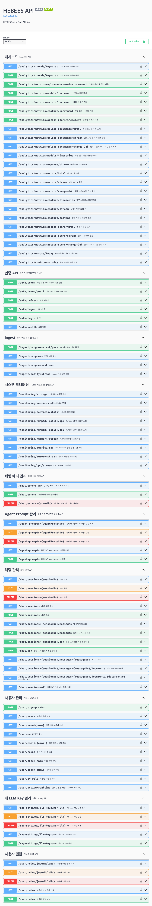
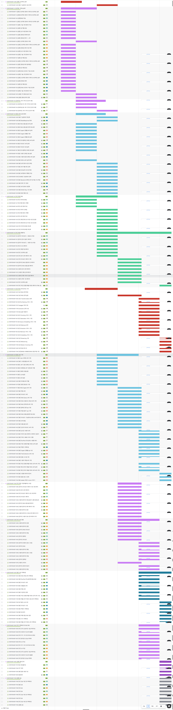
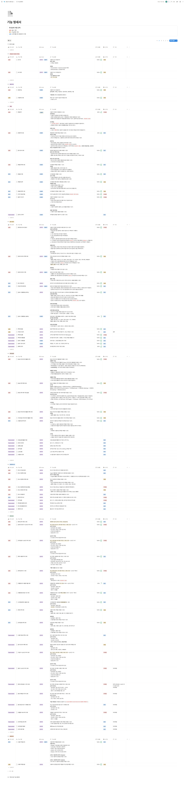
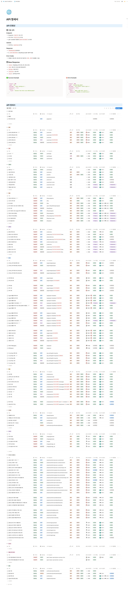
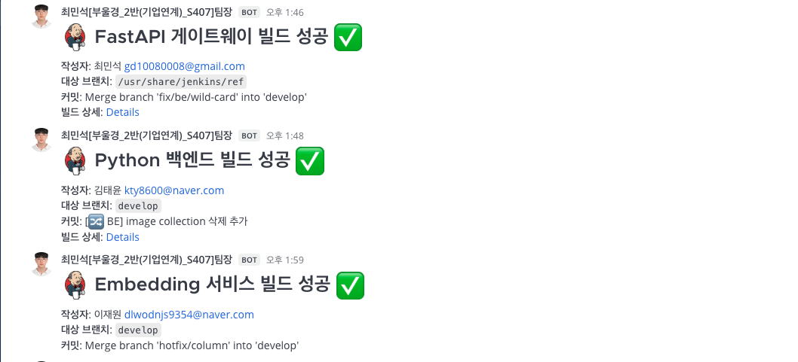
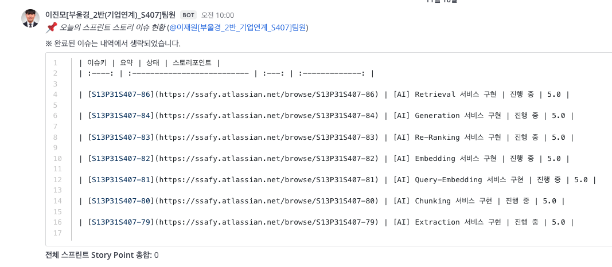
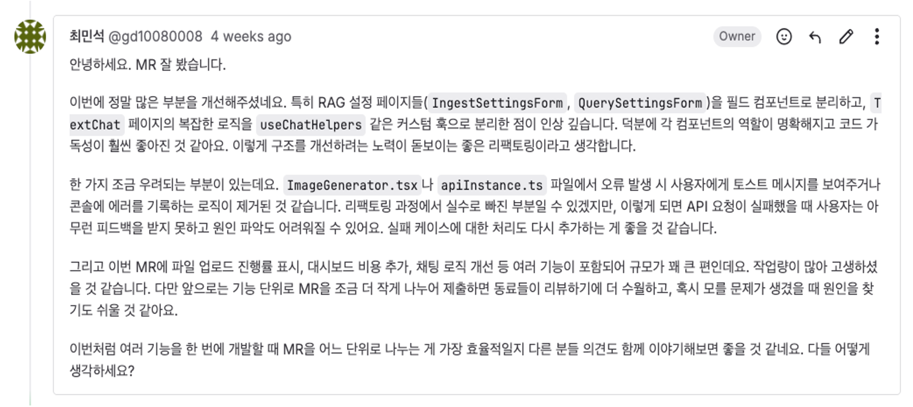

<div align="center">

# 🚀 HEBEES

</div>

**RAG 기반 지능형 문서 검색 및 답변 생성 플랫폼**<br>
**마이크로서비스 아키텍처**를 통해 확장 가능한 RAG 파이프라인을 구축하고,<br>
**다양한 문서 형식(PDF, DOCX, XLSX, TXT, 이미지)**을 지원하며,<br>
**벡터 검색과 LLM을 결합**하여 정확하고 맥락에 맞는 답변을 제공하는 엔터프라이즈급 RAG 시스템입니다.<br><br>

> 지식의 연결, 더 스마트한 검색 **HEBEES**

- **개발 기간** : 2025.10.10 ~ 2025.11.20
- **플랫폼** : Web Application
- **개발 인원** : 7명
- **기관** : 삼성 청년 SW·AI 아카데미 13기 <br><br>

## 👥 팀원 소개
<div align="center">

<table>
  <tr>
    <td width="33%" align="center">
      <a href="https://github.com/m0304s">
         <br>
        👑 최민석 <br>[Infra · Leader]
      </a>
    </td>
  </tr>

  <tr>
    <td width="300px">
      <sub>
        - MSA 기반 시스템 아키텍처 설계 및 구현 <br>
        - Marker 프로세스 구현 <br>
        - 전체 일정 관리 및 팀 리딩 <br>
        - 인프라 구조 안정화 <br>
      </sub>
    </td>
  </tr>
</table>

<br>

<table>
  <tr>
    <td width="33%" align="center">
      <a href="https://github.com/TaeYun-K">
         <br>
        김태윤 <br>[Backend]
      </a>
    </td>
    <td width="33%" align="center">
      <a href="https://github.com/minhe8564">
         <br>
        이민희 <br>[Frontend]
      </a>
    </td>
    <td width="33%" align="center">
      <a href="https://github.com/LJW9354">
         <br>
        이재원 <br>[Backend · AI]
      </a>
    </td>
  </tr>

  <tr>
    <td width="300px">
      <sub>
        - 로그인/인증 시스템 개발 <br>
        - 문서 업로드/삭제/조회 기능 개발 <br>
        - 업로드 진행률 실시간 처리 <br>
        - 알림 시스템 구축 <br>
      </sub>
    </td>
    <td width="300px">
      <sub>
        - RAG 채팅 + SSE 실시간 응답 훅 개발 <br>
        - 실시간 인프라 대시보드 개발 <br>
        - 공통 UI 컴포넌트 구축 <br>
        - 서버 API/에러 처리 규칙 통합 <br>
      </sub>
    </td>
    <td width="300px">
      <sub>
        - AI 파이프라인 오케스트레이션 <br>
        - Marker 기반 문서 파싱/레이아웃 분석 <br>
        - Embedding · 유사도 검색 · Re-ranking 구현 <br>
        - 스트리밍 AI 응답 시스템 구축 <br>
      </sub>
    </td>
  </tr>
</table>

<br>

<table>
  <tr>
    <td width="33%" align="center">
      <a href="https://github.com/hashilyze">
         <br>
        배준수 <br>[Backend · AI]
      </a>
    </td>
    <td width="33%" align="center">
      <a href="https://github.com/OPENARMS1027">
         <br>
        이진모 <br>[Frontend]
      </a>
    </td>
    <td width="33%" align="center">
      <a href="https://github.com/baekjs0123">
         <br>
        백종석 <br>[Backend · AI]
      </a>
    </td>
  </tr>

  <tr>
    <td width="300px">
      <sub>
        - ERD & API 명세 설계/관리 <br>
        - 실시간 대시보드 스트림 개발 <br>
        - LLM 채팅 및 히스토리 기능 <br>
        - RAG 커스터마이징 기능 개발
      </sub>
    </td>
    <td width="300px">
      <sub>
        - RAG 운영 데이터 대시보드(SSE) 개발 <br>
        - Ingest 업로드·처리 실시간 현황 구현 <br>
        - 벡터화 알림 시스템 구축 <br>
        - FE 구조개선 및 품질 개선
      </sub>
    </td>
    <td width="300px">
      <sub>
        - RAG 설정 템플릿 CRUD 개발 <br>
        - 개인 안경원 매출 요약 페이지 개발 <br>
        - LLM 기반 보고서 생성 API <br>
        - 체인 안경원 매출 비교 분석 로직 개발
      </sub>
    </td>
  </tr>
</table>

</div>


## 🔎 목차

<div align="center">

### <a href="#techStack">🛠️ 기술 스택</a>

### <a href="#systemArchitecture">🌐 시스템 아키텍처</a>

### <a href="#services">📦 서비스 구성</a>

### <a href="#directories">📂 디렉터리 구조</a>

### <a href="#projectDeliverables">📦 프로젝트 산출물</a>

</div> <br>

## 🛠️ 기술 스택

<a name="techStack"></a>

### 🌕 Frontend

<div align="center">

<br>


<br>


<br>

| **Category**             | **Stack**                                                                                          |
| :----------------------- | :------------------------------------------------------------------------------------------------- |
| **Language**             | TypeScript 5.9.3                                                                                   |
| **Runtime Environment**  | Node.js (Vite 기반)                                                                         |
| **Framework**            | React 18.3.1, Vite 7.1.7                                                          |
| **Styling**              | TailwindCSS 3.4.14                                                                                                        |
| **State / Data**         | Zustand 5.0.8, TanStack React Query 5.90.5                                    |
| **Form / Validation**    | React Hook Form, Zod                                                                     |
| **Network / Auth**       | Axios 1.12.2, JWT                                                                               |
| **UI / Animation**       | Lucide React 0.548.0, React Toastify 11.0.5, Lottie Web 5.13.0 |
| **Build Tool**          | Vite 7.1.7                                                                         |
| **IDE**                  | Visual Studio Code                                                                         |

</div><br>

### 🌑 Backend

<div align="center">


<br>


<br>


<br>

| **Category**   | **Stack**                                                                                                                                                                                                                                                             |
| :------------- | :-------------------------------------------------------------------------------------------------------------------------------------------------------------------------------------------------------------------------------------------------------------------- |
| **Language**   | Java 21, Python 3.11                                                                                                                                                                                                                                                               |
| **Framework**  | Spring Boot 3.5.6, FastAPI 0.119.0                                                                                                                                                                                                                                                     |
| **Build Tool** | Gradle 8.14.3, uv (Python)                                                                                                                                                                                                                                                         |
| **Libraries**  | Spring Security, Spring Data JPA, QueryDSL, Spring Data Redis, Spring Data MongoDB, WebFlux, jjwt 0.11.5, Springdoc OpenAPI 2.5.0, LangChain 1.0.3, LangChain OpenAI 1.0.1, LangChain Ollama 1.0.0, Sentence Transformers, PyTorch, Transformers |
| **Database**   | MySQL 8.0.11, MongoDB, Redis 7.4.5, Milvus (Vector DB)                                                                                                                                                                                                                         |
| **AI/ML**      | OpenAI GPT-4o, Ollama (Qwen), Sentence Transformers, Cross-Encoder                                                                                                                                                                                                                                        |
| **Storage**    | MinIO (S3 Compatible)                                                                                                                                                                                                                                             |
| **Monitoring** | Spring Actuator                                                                                                                                                                                                                                   |
| **Docs**       | Swagger UI (springdoc-openapi-starter-webmvc-ui 2.5.0)                                                                                                                                                                                                                |
| **IDE**        | IntelliJ IDEA, Visual Studio Code                                                                                                                                                                                                                             |

</div><br>

### ⚙️ Infra / DevOps

<div align="center">


<br>

| **Category**               | **Stack**                                                                 |
| :------------------------- | :------------------------------------------------------------------------ |
| **Containerization**       | Docker, Docker Compose                               |
| **CI/CD**                  | Jenkins 2.516.2                     |
| **Web / Proxy**            | Nginx 1.27                                                                |
| **Version Control** | GitLab                                                                    |

</div><br>

### 🤝 Collaboration

<div align="center">


</div>
<br>

## 🌐 시스템 아키텍처

<a name="systemArchitecture"></a>

### 🖧 System Architecture

<div align="center">

**마이크로서비스 기반 RAG 파이프라인**


</div><br>

## 📦 서비스 구성

<a name="services"></a>

<div align="center">

| **서비스명** | **설명** | **기술 스택** |
| :---------- | :------- | :------------ |
| **fastapi-gateway** | API 게이트웨이, JWT 인증, 라우팅 | FastAPI, PyJWT |
| **backend-repo** | 사용자 관리, 채팅 세션, 대시보드 | Spring Boot, MySQL, MongoDB, Redis |
| **python-backend-repo** | 파일 관리, MinIO 연동 | FastAPI, MinIO |
| **ingest-repo** | 문서 수집 및 파이프라인 오케스트레이션 | FastAPI, MySQL, Redis |
| **extract-repo** | 문서 추출 (PDF, DOCX, XLSX, TXT, 이미지) | FastAPI, PyMuPDF, python-docx, openpyxl, OpenAI |
| **chunking-repo** | 문서 청킹 (의미 단위 분할) | FastAPI, Transformers, PyTorch |
| **embedding-repo** | 문서 임베딩 생성 | FastAPI, Sentence Transformers, PyTorch, Milvus |
| **query-embedding-repo** | 쿼리 임베딩 생성 | FastAPI, Sentence Transformers |
| **search-repo** | 벡터 유사도 검색 | FastAPI, LangChain, Milvus |
| **cross-encoder-repo** | 검색 결과 재정렬 | FastAPI, Sentence Transformers, Cross-Encoder |
| **generation-repo** | LLM 답변 생성 (OpenAI, Ollama) | FastAPI, LangChain, OpenAI, Ollama, MongoDB |
| **frontend-repo** | 웹 프론트엔드 | React, TypeScript, Vite, TanStack Query, Zustand |
| **rag-data-marker** | 문서 마킹 처리 | FastAPI |
| **rag-data-yolo** | YOLO 기반 문서 레이아웃 분석 | FastAPI, YOLO |
| **rag-embedding-model-runpod** | RunPod 기반 임베딩 모델 서비스 | FastAPI, RunPod |

</div><br>

## 📂 디렉터리 구조

<a name="directories"></a>

### 🌕 Frontend

<details align="left">
  <summary>
    <strong>Frontend-App</strong>
  </summary>

```
📦 frontend-repo
 ┣ 📂public
 ┃ ┣ 📂fonts
 ┃ ┣ 📂lotties
 ┃ ┗ 📜hebees-logo.webp
 ┣ 📂src
 ┃ ┣ 📂app
 ┃ ┣ 📂assets
 ┃ ┣ 📂domains
 ┃ ┃ ┣ 📂admin
 ┃ ┃ │ ┣ 📂api
 ┃ ┃ │ ┣ 📂components
 ┃ ┃ │ │ ┣ 📂dashboard
 ┃ ┃ │ │ ┣ 📂documents
 ┃ ┃ │ │ ┣ 📂rag-settings
 ┃ ┃ │ │ ┣ 📂rag-test
 ┃ ┃ │ │ ┗ 📂users
 ┃ ┃ │ ┣ 📂hooks
 ┃ ┃ │ ┣ 📂pages
 ┃ ┃ │ ┣ 📂types
 ┃ ┃ │ ┗ 📂utils
 ┃ ┃ ┣ 📂auth
 ┃ ┃ │ ┣ 📂api
 ┃ ┃ │ ┣ 📂components
 ┃ ┃ │ ┣ 📂pages
 ┃ ┃ │ ┗ 📂store
 ┃ ┃ ┗ 📂user
 ┃ ┃   ┣ 📂api
 ┃ ┃   ┣ 📂components
 ┃ ┃   ┣ 📂hooks
 ┃ ┃   ┣ 📂pages
 ┃ ┃   ┗ 📂types
 ┣ 📂guards
 ┣ 📂layouts
 ┣ 📂router
 ┣ 📂shared
 ┣ 📜App.tsx
 ┣ 📜main.tsx
 ┣ 📜vite.config.ts
 ┣ 📜tailwind.config.js
 ┗ 📜package.json
```

</details>

### 🌑 Backend

<details align="left">
  <summary>
    <strong>Backend-Core (Spring Boot)</strong>
  </summary>

```
📦 backend-repo
 ┣ 📂src
 ┃ ┣ 📂main
 ┃ ┃ ┣ 📂java
 ┃ ┃ │ ┗ 📂com/ssafy/hebees
 ┃ ┃ │   ┣ 📂auth
 ┃ ┃ │   │ ┣ 📂controller
 ┃ ┃ │   │ ┣ 📂dto
 ┃ ┃ │   │ ┗ 📂service
 ┃ ┃ │   ┣ 📂chat
 ┃ ┃ │   │ ┣ 📂client
 ┃ ┃ │   │ ┣ 📂config
 ┃ ┃ │   │ ┣ 📂controller
 ┃ ┃ │   │ ┣ 📂dto
 ┃ ┃ │   │ ┣ 📂entity
 ┃ ┃ │   │ ┣ 📂event
 ┃ ┃ │   │ ┣ 📂repository
 ┃ ┃ │   │ ┗ 📂service
 ┃ ┃ │   ┣ 📂common
 ┃ ┃ │   │ ┣ 📂config
 ┃ ┃ │   │ ┣ 📂dto
 ┃ ┃ │   │ ┣ 📂entity
 ┃ ┃ │   │ ┣ 📂exception
 ┃ ┃ │   │ ┣ 📂interceptor
 ┃ ┃ │   │ ┣ 📂response
 ┃ ┃ │   │ ┣ 📂security
 ┃ ┃ │   │ ┗ 📂util
 ┃ ┃ │   ┣ 📂dashboard
 ┃ ┃ │   │ ┣ 📂chat
 ┃ ┃ │   │ ┣ 📂controller
 ┃ ┃ │   │ ┣ 📂dto
 ┃ ┃ │   │ ┣ 📂entity
 ┃ ┃ │   │ ┣ 📂keyword
 ┃ ┃ │   │ ┣ 📂model
 ┃ ┃ │   │ ┣ 📂repository
 ┃ ┃ │   │ ┣ 📂service
 ┃ ┃ │   │ ┗ 📂util
 ┃ ┃ │   ┣ 📂ingest
 ┃ ┃ │   │ ┣ 📂controller
 ┃ ┃ │   │ ┣ 📂dto
 ┃ ┃ │   │ ┗ 📂service
 ┃ ┃ │   ┣ 📂monitoring
 ┃ ┃ │   │ ┣ 📂client
 ┃ ┃ │   │ ┣ 📂config
 ┃ ┃ │   │ ┣ 📂controller
 ┃ ┃ │   │ ┣ 📂dto
 ┃ ┃ │   │ ┣ 📂entity
 ┃ ┃ │   │ ┣ 📂repository
 ┃ ┃ │   │ ┗ 📂service
 ┃ ┃ │   ┣ 📂offer
 ┃ ┃ │   │ ┣ 📂entity
 ┃ ┃ │   │ ┗ 📂repository
 ┃ ┃ │   ┣ 📂ragsetting
 ┃ ┃ │   │ ┣ 📂controller
 ┃ ┃ │   │ ┣ 📂dto
 ┃ ┃ │   │ ┣ 📂entity
 ┃ ┃ │   │ ┣ 📂repository
 ┃ ┃ │   │ ┗ 📂service
 ┃ ┃ │   ┣ 📂user
 ┃ ┃ │   │ ┣ 📂controller
 ┃ ┃ │   │ ┣ 📂dto
 ┃ ┃ │   │ ┣ 📂entity
 ┃ ┃ │   │ ┣ 📂repository
 ┃ ┃ │   │ ┗ 📂service
 ┃ ┃ │   ┗ 📂HebeesApplication.java
 ┃ ┃ ┗ 📂resources
 ┃ ┗ 📂test
 ┣ 📜build.gradle
 ┣ 📜Dockerfile
 ┗ 📜Jenkinsfile
```

</details>

### 🐍 Python Services

<details align="left">
  <summary>
    <strong>RAG Pipeline Services</strong>
  </summary>

```
📦 RAG Services
 ┣ 📂fastapi-gateway
 ┃ ┣ 📂app
 ┃ │ ┣ 📂common (auth, cache)
 ┃ │ ┣ 📂core (settings, database, utils)
 ┃ │ ┣ 📂routers (rag_router, backend_router)
 ┃ │ ┗ 📂services (proxy_service, docs_service)
 ┃ ┗ 📜run.py
 ┣ 📂ingest-repo
 ┃ ┣ 📂app
 ┃ │ ┣ 📂core (database, settings)
 ┃ │ ┣ 📂routers (ingest_router, query_router)
 ┃ │ ┣ 📂schemas
 ┃ │ ┣ 📂service (ingest_service, query_service, gateway_client)
 ┃ │ ┗ 📂models
 ┃ ┗ 📜run.py
 ┣ 📂extract-repo
 ┃ ┣ 📂app
 ┃ │ ┣ 📂routers
 ┃ │ ┣ 📂schemas
 ┃ │ ┣ 📂service
 ┃ │ ┗ 📂src (extraction strategies)
 ┃ ┗ 📜run.py
 ┣ 📂chunking-repo
 ┃ ┣ 📂app
 ┃ │ ┣ 📂routers
 ┃ │ ┣ 📂schemas
 ┃ │ ┣ 📂service
 ┃ │ ┗ 📂src (chunking strategies)
 ┃ ┗ 📜run.py
 ┣ 📂embedding-repo
 ┃ ┣ 📂app
 ┃ │ ┣ 📂routers
 ┃ │ ┣ 📂schemas
 ┃ │ ┣ 📂service
 ┃ │ ┣ 📂src (embedding strategies)
 ┃ │ ┗ 📂models
 ┃ ┗ 📜run.py
 ┣ 📂query-embedding-repo
 ┃ ┣ 📂app
 ┃ │ ┣ 📂routers
 ┃ │ ┣ 📂schemas
 ┃ │ ┣ 📂service
 ┃ │ ┣ 📂services
 ┃ │ ┗ 📂src (query embedding strategies)
 ┃ ┗ 📜run.py
 ┣ 📂search-repo
 ┃ ┣ 📂app
 ┃ │ ┣ 📂routers
 ┃ │ ┣ 📂schemas
 ┃ │ ┣ 📂service
 ┃ │ ┗ 📂src (search strategies)
 ┃ ┗ 📜run.py
 ┣ 📂cross-encoder-repo
 ┃ ┣ 📂app
 ┃ │ ┣ 📂routers
 ┃ │ ┣ 📂schemas
 ┃ │ ┗ 📂src (cross-encoder strategies)
 ┃ ┗ 📜run.py
 ┣ 📂generation-repo
 ┃ ┣ 📂app
 ┃ │ ┣ 📂core (memory_manager, custom_chat_history)
 ┃ │ ┣ 📂routers
 ┃ │ ┣ 📂schemas
 ┃ │ ┣ 📂service
 ┃ │ ┗ 📂src (generation strategies: openai, ollama)
 ┃ ┗ 📜run.py
 ┣ 📂python-backend-repo
 ┃ ┣ 📂app
 ┃ │ ┣ 📂core
 ┃ │ ┗ 📂domains
 ┃ ┗ 📜run.py
 ┣ 📂rag-data-marker
 ┃ ┣ 📂app
 ┃ │ ┣ 📂processors
 ┃ │ ┣ 📂routers
 ┃ │ ┗ 📂services
 ┃ ┗ 📜run.py
 ┣ 📂rag-data-yolo
 ┃ ┣ 📂app
 ┃ │ ┣ 📂processors
 ┃ │ ┗ 📂routers
 ┃ ┗ 📜run.py
 ┗ 📂rag-embedding-model-runpod
   ┣ 📂app
   │ ┣ 📂api
   │ ┣ 📂models
   │ ┗ 📂services
   ┗ 📜main.py
```

</details>

<br>

## 📦 프로젝트 산출물

<a name="projectDeliverables"></a>

### 📐 와이어프레임

<div>


</div><br>

### 🗄️ ERD

<div>


</div><br>

<h3>✅ Swagger API Docs</h3>
<details align="left">
  <summary>
    <strong>Backend</strong>
  </summary>

  <div align="center">

  
  </div>
</details>

<h3>📅 Jira Issues</h3>
<details align="left">
  <summary>
    <strong>자세히</strong>
  </summary>

  <div align="center">
    
  </div>
</details>

<h3>📋 기능 명세서</h3>
<details align="left">
  <summary>
    <strong>자세히</strong>
  </summary>

  <div align="center">
    
  </div>
</details>

<h3>📡 API 명세서</h3>
<details align="left">
  <summary>
    <strong>자세히</strong>
  </summary>

  <div align="center">
    
  </div>
</details><br>

### 📢 Collaboration & Event Notification

<div align="center">

<table>
  <tr>
    <td align="center" width="33%"><b>🧩 Jenkins Pipeline</b></td>
    <td align="center" width="50%"><b>🗨️ Jira Issue Created</b></td>
    <td align="center" width="33%"><b>🔀 Merge Code Review</b></td>
  </tr>
  <tr>
    <td align="center">
      
    </td>
    <td align="center">
      
    </td>
    <td align="center">
      
    </td>
  </tr>
</table>

</div>

### 📊 주요 기능

<div align="center">

| **기능** | **설명** |
| :------- | :------- |
| **문서 수집 (Ingest)** | PDF, DOCX, XLSX, TXT, 이미지 파일 업로드 및 처리 |
| **문서 추출 (Extract)** | 다양한 형식의 문서에서 텍스트 및 이미지 추출 (Marker, YOLO 활용) |
| **문서 청킹 (Chunking)** | 의미 단위로 문서 분할 |
| **임베딩 생성 (Embedding)** | 텍스트/이미지를 벡터로 변환하여 Milvus에 저장 |
| **벡터 검색 (Search)** | 쿼리와 유사한 문서 검색 |
| **재정렬 (Cross-Encoder)** | 검색 결과 정확도 향상을 위한 재정렬 |
| **답변 생성 (Generation)** | LLM을 통한 맥락 기반 답변 생성 (OpenAI, Ollama/Qwen) |
| **스트리밍 응답** | SSE를 통한 실시간 답변 스트리밍 |
| **대화 기록 관리** | MongoDB를 통한 채팅 히스토리 저장 |
| **대시보드** | 사용량 통계, 에러 모니터링, 키워드 분석 |
| **RAG 설정 관리** | 추출, 청킹, 임베딩, 검색, 재정렬, 프롬프트 전략 설정 |

</div><br>

### 🎨 주요 화면

<div align="center">

#### 📝 사용자 채팅


#### 📄 문서 업로드 (사용자)


#### 🖼️ 이미지 생성 (사용자)


#### 📊 운영 대시보드


#### ⚙️ RAG 대시보드


</div><br>

---

<div align="center">

**HEBEES** - 지식의 연결, 더 스마트한 검색

</div>


